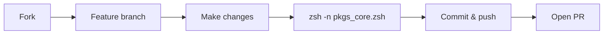

<p align="center">
   
</p>

<p align="center">
   <em><sub>Screenshot may not reflect the latest version. Run <code>pkgs</code> to see the current interface.</sub></em>
</p>

<p align="center">
  
</p>

<p align="center">
  <sub><em>Screenshot may not reflect the latest version. Run <code>pkgs</code> to see the current interface.</em></sub>
</p>

<p align="center">
  <a href="https://github.com/Mark44928/Termux-TUI-Package-Store/releases">
    
  </a>
  <a href="https://github.com/Mark44928/Termux-TUI-Package-Store/stargazers">
    
  </a>
  <a href="https://github.com/Mark44928/Termux-TUI-Package-Store/forks">
    
  </a>
  <a href="https://github.com/Mark44928/Termux-TUI-Package-Store/issues">
    
  </a>
</p>

<p align="center">
  <a href="https://github.com/Mark44928/Termux-TUI-Package-Store/blob/main/LICENSE">
    
  </a>
  <a href="https://github.com/Mark44928/Termux-TUI-Package-Store">
    
  </a>
  <a href="https://img.shields.io/badge/PRs-welcome-orange?style=for-the-badge">
    
  </a>
  <a href="https://github.com/Mark44928/Termux-TUI-Package-Store">
    
  </a>
  <a href="https://github.com/Mark44928/Termux-TUI-Package-Store">
    
  </a>
</p>

<h1 align="center">📦 Termux TUI Package Store</h1>

<p align="center">
  <b>v1.4.0</b> ── <em>Interactive fzf-powered terminal UI for browsing, previewing, installing, and removing Termux packages</em>
</p>

<br>

<p align="center">
  <b>⚡ One keystroke · Instant preview · Persistent session · 134 slash commands</b>
</p>

<p align="center">
  <a href="#quick-install"><b>Quick Install</b></a> •
  <a href="#usage"><b>Usage</b></a> •
  <a href="#configuration"><b>Configuration</b></a> •
  <a href="#contributing"><b>Contributing</b></a>
</p>

<p align="center">
  ⭐ <b>Star this repo</b> if you find it useful — it helps others discover it!
</p>

---

## 🤔 Why pkgs?

| Problem with `pkg` | ✅ How pkgs solves it |
|---|---|
| Typing full package names every time | Fuzzy search matches partial names instantly |
| No preview of what you're installing | Live pane shows version, size, deps, and description |
| Have to run install/remove separately for each package | Tab to select multiple, or use `/install <query>` for bulk ops |
| Session closes after every install | Persistent loop — keep managing packages until you press Esc |
| No way to audit installed packages | Color-coded `[✓]` / `[ ]` tags at a glance |

---

## 🎯 Perfect For

- **Termux power users** who manage dozens of packages regularly
- **Android developers** setting up fresh Termux environments
- **Automation lovers** who want to export install scripts in one click
- **New Termux users** overwhelmed by typing `pkg install` repeatedly

---

## 📋 Table of Contents

- [Overview](#overview)
- [Features](#features)
- [Requirements](#requirements)
- [Quick Install](#quick-install)
- [Manual Installation](#manual-installation)
- [Usage](#usage)
  - [Slash Commands](#slash-commands)
- [Key Bindings](#key-bindings)
- [How It Works](#how-it-works)
- [Configuration](#configuration)
- [Troubleshooting](#troubleshooting)
- [FAQ](#faq)
- [Uninstallation](#uninstallation)
- [Contributing](#contributing)
- [Changelog](#changelog)
- [License](#license)
- [Disclaimer](#disclaimer)
- [Acknowledgments](#acknowledgments)

---

## 👀 Overview

**Termux TUI Package Store** is a terminal UI for managing packages on Termux. It wraps `pkg` with an interactive fuzzy-finder that lets you search, preview, install, and remove packages — all without leaving a single screen.

The tool adapts to your terminal size, color-codes installed vs. available packages, and shows live metadata previews (version, size, dependencies, description) for every package you highlight. Type `/help` in the search box to see all **134** available slash commands.

---

## ✨ Features

| Feature | Description |
|---|---|
| **🔍 Fuzzy Search** | Filter hundreds of packages instantly as you type |
| **📋 Live Previews** | See version, installed/download size, dependencies, and description for any package |
| **🔄 Persistent Session** | Store stays open after install/remove — keep going until you press Esc |
| **📐 Smart Layout** | Automatically switches between landscape (side-by-side) and portrait (stacked) preview |
| **🎨 Color-Coded Status** | Installed packages tagged `[✓]`, available packages tagged `[ ]` |
| **⚡ 134 Slash Commands** | Bulk install/remove/export, filters, sorting, notes, comparison, backup/restore, dependency analysis, hold/unhold, changelogs, file search, mirror management, themes, snapshots, quick install, security checks, profiles, health checks, storage monitoring, cache dashboard, batch upgrade, activity log, dependency graph, and more |
| **📦 Batch Operations** | Multi-select with Tab, preview with dry-run, categorized summary with progress |
| **🛡️ Prerequisite Checks** | Validates fzf, pkg, apt-cache, and dpkg-query on startup |
| **📊 Disk Usage** | Visual breakdown by section with bar charts |
| **📝 Package Notes** | Add/edit notes per package, persisted across sessions |
| **⚖️ Package Comparison** | Side-by-side view of two packages |
| **💾 Backup & Restore** | Export full package list, reinstall from it later |
| **🕐 Recent Activity** | Filter packages installed today via dpkg logs |
| **📜 Operation History** | Daily log of all install/remove/export operations |
| **↩️ Undo Support** | Reverse last install or remove operation |
| **⚡ Zero Config** | No config files needed — runs as a single script at `$PREFIX/bin/pkgs` |

### 🎛️ Slash Commands (134 total)

<details>
<summary><b>📦 Package Operations</b> — install, remove, upgrade, export</summary>

| Command | Description |
|---|---|
| `/install <query>` | Install all packages matching `<query>` |
| `/remove <query>` | Remove all packages matching `<query>` |
| `/purge <pkg>` | Remove package + config files |
| `/reinstall <pkg>` | Reinstall a package |
| `/hold <pkg>` | Pin package (prevent upgrade) |
| `/unhold <pkg>` | Unpin package (allow upgrade) |
| `/upgrade` | Upgrade all installed packages |
| `/batch-upgrade` | Interactive fzf multi-select of upgradable packages |
| `/update` | Update apt cache |
| `/clean` | Remove orphans + clean apt cache |
| `/auto-clean` | Auto-remove orphaned deps + clean cache |
| `/export <query>` | Export matching packages to a runnable shell script |
| `/export-all` | Export all installed packages to a script |
| `/export-versions` | Export package list with version numbers + sizes |
</details>

<details>
<summary><b>🔍 Search & Filter</b> — find packages by name, description, size, file</summary>

| Command | Description |
|---|---|
| `/search <text>` | Search package descriptions (not just names) |
| `/search-file <text>` | Search installed files by name |
| `/search-size <min> <max>` | Find packages by size range (KiB) |
| `/search-providers <cmd>` | Find packages providing a command/binary |
| `/search-history <text>` | Search operation history |
| `/installed` | Filter: show only installed packages |
| `/available` | Filter: show only available packages |
| `/recent` | Filter: show only packages installed today |
| `/all` | Reset filter: show all packages |
| `/sort name` or `/sort size` | Sort packages by name or size |
| `/size-filter <min> <max>` | Filter by installed size (KiB) |
| `/compact` | Toggle compact fzf mode |
| `/size` | Total installed size |
| `/count` | Count installed/available packages |
| `/group` | Group packages by section |
| `/upgradable` | Upgradable packages with version diff |
| `/size-histogram` | Visual package size distribution |
</details>

<details>
<summary><b>📊 Information & Analysis</b> — details, dependencies, impact</summary>

| Command | Description |
|---|---|
| `/info <pkg>` | Full package details in a panel |
| `/deps <pkg>` | What a package depends on |
| `/rdeps <pkg>` | Reverse dependencies (what depends on this) |
| `/depends-on <pkg>` | Installed packages that depend on this |
| `/depends-chain <a> <b>` | Dependency chain between two packages |
| `/depends-on-list <pkgs>` | Shared dependencies of multiple packages |
| `/tree <pkg>` | Show dependency tree |
| `/deptree <pkg>` | Visual ASCII dependency tree |
| `/reverse-tree <pkg>` | Reverse dependency tree |
| `/dep-graph <pkg>` | ASCII dependency tree (3 levels, circular detection) |
| `/fuzzy-dep` | Interactive dependency explorer |
| `/compare <pkg1> <pkg2>` | Side-by-side field comparison + dep overlap |
| `/why <pkg>` | Show why a package is installed |
| `/suggest <pkg>` | Show suggested/recommended/depending packages |
| `/pkg-recommendations <pkg>` | Who recommends this package |
| `/pkg-suggests <pkg>` | Who suggests this package |
| `/pkg-breaks <pkg>` | What breaks if this is installed |
| `/pkg-replaces <pkg>` | What this package replaces |
| `/conflicts-with <pkg>` | Show conflicting packages |
| `/provides <pkg>` | Show virtual packages provided |
| `/owner <file>` | Which package owns this file (dpkg -S) |
| `/whatprovides <file>` | Which package provides a binary |
| `/check` | Verify installed packages integrity |
| `/check-deps` | Validate all dependencies are satisfied |
| `/missing` | Check for missing dependencies |
| `/footprint <pkg>` | Total install footprint including deps |
| `/pkg-impact <pkg>` | Pre-install impact analysis (new deps, disk cost) |
</details>

<details>
<summary><b>🕐 History & Activity</b> — logs, undo, changelogs, timeline</summary>

| Command | Description |
|---|---|
| `/history` | View last 7 days of operation log |
| `/activity-log [days]` | Activity summary with per-action counts |
| `/review` | Today's activity summary |
| `/stats` | Today's install/remove counts |
| `/pkg-history <pkg>` | Per-package install/upgrade/remove history |
| `/pkg-changes` | What changed in last apt upgrade |
| `/pkg-ages` | Age of each installed package |
| `/changelog <pkg>` | Package changelog |
| `/diff <pkg>` | Changelog diff of last upgrade |
| `/whatsnew` | Recent upgrade changelogs |
| `/timeline` | Visual install/upgrade activity map |
| `/undo` | Reverse last install or remove |
| `/removed` | Packages removed in last upgrade |
| `/new-pkgs` | Packages installed this week |
</details>

<details>
<summary><b>🛠️ Maintenance & Cleanup</b> — orphans, disk, security, backup</summary>

| Command | Description |
|---|---|
| `/orphans` | Show orphaned packages |
| `/orphans-safe` | Safe orphans (no essential dependents) |
| `/orphans-remove` | Remove all orphaned packages |
| `/outdated` | Packages with available updates |
| `/outdated-top <n>` | Top N packages with updates by size |
| `/top` | Top 10 largest installed packages |
| `/top <n>` | Top N largest installed packages |
| `/usage` | Disk usage breakdown by section |
| `/usage <pkg>` | Installed files for a package |
| `/usage-top` | Disk usage bar chart (top packages) |
| `/storage-report` | Detailed storage consumption report |
| `/disk-pressure` | Storage pressure estimate + days-till-full |
| `/nuke` | Interactive storage cleanup |
| `/unused-libs` | Find orphaned .so libraries |
| `/unused` | Find installed packages never invoked |
| `/duplicate` | Find duplicate/virtual packages |
| `/same-size` | Packages with identical installed size |
| `/security` | Check for outdated packages |
| `/audit` | Scan for SUID/SGID + world-writable files |
| `/repo-check` | Flag packages from untrusted repos |
| `/repo-stats` | Packages per repository breakdown |
| `/health` | Full system health check |
| `/cache-stats` | Cache + stats dashboard |
| `/backup` | Export full package list to a file |
| `/restore <file>` | Install all packages from a backup file |
| `/snapshot` | Save installed package snapshot |
| `/snapshot-list` | List saved snapshots |
| `/snapshot-restore` | Restore from a snapshot |
| `/diff-snapshots` | Diff two saved snapshots |
</details>

<details>
<summary><b>🔗 Mirror & Repository</b> — switch mirrors, check origins</summary>

| Command | Description |
|---|---|
| `/mirror` | Switch apt mirror |
| `/mirror-backup` | Backup/restore sources.list snapshots |
| `/mirror-latency` | Ping-test mirrors, rank by latency |
| `/mirror-bandwidth` | Bandwidth-test mirrors, rank by speed |
</details>

<details>
<summary><b>⭐ Favorites & Profiles</b> — saved packages and configurations</summary>

| Command | Description |
|---|---|
| `/fav <pkg>` | Toggle package favorite |
| `/fav-list` | Show all favorites |
| `/fav-remove` | Remove a favorite |
| `/profile` | Switch between named package profiles |
| `/import <file>` | Install from package list file |
| `/quick` | Quick install popular package sets |
| `/popular` | Curated list of popular Termux packages |
</details>

<details>
<summary><b>📝 Notes & Docs</b> — annotations, tips, maintainer search</summary>

| Command | Description |
|---|---|
| `/note <pkg> <text>` | Add or view a note for a package |
| `/tips` | Termux tips and tricks |
| `/maintainer <name>` | Search packages by maintainer |
| `/log-search <text>` | Search dpkg/apt history logs |
</details>

<details>
<summary><b>⚙️ System & Utilities</b> — version, theme, benchmarking, scheduling</summary>

| Command | Description |
|---|---|
| `/version` | Show system version info |
| `/theme` | Switch color scheme (7 themes) |
| `/theme-preview` | Preview current color scheme |
| `/keys` | Fzf keybinding reference overlay |
| `/boot-time` | Benchmark Termux shell startup time |
| `/schedule` | Set up update reminders |
| `/shell-hook` | Generate shell integration hook |
| `/self-update` | Update pkgs from GitHub |
| `/plan <cmd>` | Dry-run preview (install/remove/upgrade) |
| `/upgrade-plan` | Simulate upgrade, show what would change |
| `/upgrade-size` | Total download size before upgrading |
| `/download <pkg>` | Download without installing |
| `/download-size <pkg>` | Download + installed size |
| `/download-est <pkg>` | Download + installed size + expansion ratio |
| `/verify <pkg>` | Verify package checksums/integrity |
| `/simulate-remove <pkg>` | Simulate removal, show consequences |
| `/snap-install <file>` | Install from local .deb file |
| `/help` | Show in-app help |

---

## 📦 Requirements

- **Termux** (Android 7+) — [Get it from F-Droid](https://f-droid.org/en/packages/com.termux/) or [GitHub](https://github.com/termux/termux-app)
- **Zsh** — the script runs on zsh (`pkg install zsh`)

### Runtime Dependencies

| Package | Purpose | Required |
|---|---|---|
| `fzf` | Fuzzy-finder interface | ✅ Yes |
| `gawk` | Data processing (package list generation) | ✅ Yes |
| `grep`, `sed` | Text processing in previews | ✅ Yes |
| `ncurses` | Terminal handling (`tput`) | ✅ Yes |
| `dpkg` | Package queries (`dpkg-query`) | ✅ Yes |
| `apt-cache` | Package metadata and search | ✅ Yes |
| `coreutils` | Human-readable sizes (`numfmt`) | 🔶 Optional |
| `curl` | Self-update (`/self-update`) | 🔶 Optional |

> **Note:** Tested on Termux v0.118.x with fzf 0.53.0. Older versions may work but are not guaranteed.

---

## 🚀 Quick Install

```sh
zsh <(curl -fsSL https://raw.githubusercontent.com/Mark44928/Termux-TUI-Package-Store/main/install.sh)
```

> **💡 Prerequisite:** The installer requires `zsh`. If it's not installed, run `pkg install zsh` first.

---

## 📥 Manual Installation

<details>
<summary><b>Step-by-step setup</b> (click to expand)</summary>

1. **Install dependencies:**

   ```sh
   pkg update && pkg upgrade
   pkg install zsh fzf coreutils gawk grep sed ncurses curl figlet
   ```

2. **Download the script and make it executable:**

   ```sh
   curl -fsSL https://raw.githubusercontent.com/Mark44928/Termux-TUI-Package-Store/main/pkgs_core.zsh -o "$PREFIX/bin/pkgs"
   chmod +x "$PREFIX/bin/pkgs"
   ```

   > **Note:** The source file is `pkgs_core.zsh` in this repo, but it is installed as `$PREFIX/bin/pkgs` on your device. Edit that file to customize behavior.

3. **Run it:**

   ```sh
   pkgs
   ```
</details>

---

## 🎮 Usage

Launch the store with a single command:

```sh
pkgs
```

### 🔎 Basic Operation

- **Type** to filter packages — the list updates in real time
- **Press Enter** on a package to install (if not installed) or remove (if installed)
- **Press Esc / Ctrl+C** to exit
- The store **re-opens automatically** after every operation

### 🎯 Pre-Filtered Launch

Pass a search term to open the store with it pre-typed:

```sh
pkgs python      # Opens with "python" in the search box
pkgs vim         # Opens with "vim" in the search box
```

### 💬 Slash Commands

Type any `/command` directly in the search box. See the [Slash Commands](#-slash-commands-134-total) section for all 134.

**Everyday examples:**

```sh
/install python          # Install all packages matching "python"
/remove vim              # Remove all matching packages
/export git              # Save matching packages to a script
/search editor           # Find packages whose descriptions mention "editor"
/rdeps python            # What depends on python?
/clean                   # Clean up orphans + apt cache
/batch-upgrade           # Interactive multi-select upgrade picker
/keys                    # Show all keybindings
```

---

## ⌨️ Key Bindings

| Key | Action |
|---|---|
| `Enter` | Process selected packages (`y`=process, `d`=dry-run, `e`=export, `Enter`=cancel) |
| `Tab` | Select multiple packages |
| `Ctrl-A` | Select all visible packages |
| `Ctrl-D` | Deselect all packages |
| `?` | Toggle the preview pane |
| `Esc` or `Ctrl+C` | Exit the store |
| _Typing_ | Search/filter packages in real time |

---

## 🔧 How It Works

1. **📐 Layout Detection**  
   The tool measures your terminal with `tput` and decides whether to show the preview alongside the package list (wide terminals) or below it (narrow terminals).

2. **📡 Package Discovery**  
   An `awk` script cross-references installed packages from `dpkg-query` against every available package from `apt-cache search ".*"`. Each line is tagged `[✓]` (installed) or `[ ]` (not installed).

3. **👁️ Live Previews**  
   When you highlight a package, `fzf` runs `apt-cache show` in the background and displays version, section, size, top dependencies, and the description.

4. **⚡ Slash Commands**  
   Typing any `/command` in the search box triggers bulk operations instead of package selection. Packages are validated against `apt-cache` before any action runs.

5. **🔄 Action & Loop**  
   Pressing Enter shows a batch summary with install/remove categorization. Choose `y` to process, `d` for dry-run, `e` to export, or Enter to cancel. After processing, the store refreshes automatically.

---

## ⚙️ Configuration

> **Note:** `$PREFIX` is Termux's installation prefix, typically `/data/data/com.termux/files/usr`.

The entire script lives in a single file at `$PREFIX/bin/pkgs`. Edit it directly to customize behavior.

### 📐 Preview Window

| Setting | Default | Description |
|---|---|---|
| `PORTRAIT_SPLIT` | `down:48%:wrap` | Preview position/height in portrait mode |
| `LANDSCAPE_SPLIT` | `right:40%:wrap` | Preview position/width in landscape mode |

**Examples:**

```zsh
PORTRAIT_SPLIT="down:60%:wrap"    # Taller preview in portrait
LANDSCAPE_SPLIT="left:40%:wrap"    # Preview on the left in landscape
```

### 🎨 Colors

The `--color` flag in `_pkgs_build_fzf_args` uses 256-color ANSI codes. Customize any element:

```zsh
--color='fg:223,bg:-1,hl:114,fg+:223,bg+:235,hl+:109,info:109,prompt:180,pointer:203,marker:114,spinner:139,header:59'
```

See the [fzf documentation](https://github.com/junegunn/fzf#color-schemes) for available color slots.

### 🖌️ Message Colors

| Variable | Default | Description |
|---|---|---|
| `C_INST_PREFIX` | `[✓]` (green) | Tag for installed packages |
| `C_NOT_INST_PREFIX` | `[ ]` (dim) | Tag for not-installed packages |
| `C_PKG_NAME` | Green | Package name in list |
| `C_PKG_DESC` | Dim | Description in list |
| `C_MSG_INSTALL` | Green | Install success messages |
| `C_MSG_REMOVE` | Red | Remove/failure messages |
| `C_MSG_INFO` | Amber | Info/prompts |
| `C_MSG_WARN` | Amber | Warning messages |
| `C_MSG_DONE` | Teal | Completion messages |

### ⚡ Behavior

| Variable | Default | Description |
|---|---|---|
| `PKG_MGR` | `pkg` | Package manager command (`pkg` or `apt`) |
| `BORDER_STYLE` | `rounded` | fzf border style (`rounded`, `sharp`, `double`, `bold`) |

### 💡 Common Customizations

| If you want to... | Do this |
|---|---|
| Reinstall instead of install | Change `${PKG_MGR} install` → `${PKG_MGR} reinstall` |
| Log every action to a file | Add `echo "$(date): $action $pkg_name" >> ~/.pkgs_history` |
| Exclude library packages | Append `\| grep -vE '^(lib\|python-\|perl-\|ruby-)'` to the pipeline |
| Hide already-installed packages | Pipe through `grep -v '\[✓\]'` after the awk script |
| Use a floating overlay | Add `--height=80%` to `FZF_ARGS` |
| Hide preview by default | Change `--preview-window` to `...:hidden` (press `?` to toggle) |
| Keep search query across ops | Store the query before fzf exits and pass it back on re-entry |

---

## 🔍 Troubleshooting

| Problem | Likely Cause | Fix |
|---|---|---|
| `pkgs: command not found` | Script not in PATH | Run `which pkgs` — should show `$PREFIX/bin/pkgs`. Re-run `install.sh` if missing. |
| `zsh: no such file or directory` | Shebang path wrong | Run `head -1 $(which pkgs)` — should show `#!/data/data/com.termux/files/usr/bin/zsh`. Reinstall if corrupted. |
| Empty package list | `apt-cache` needs updating | Run `pkg update` and try again. |
| `fzf: command not found` | Dependency missing | Run `pkg install fzf`. |
| Colors look wrong | Terminal lacks 256-color support | Simplify the `--color` flag to basic 16-color ANSI codes. |
| Preview shows nothing | `apt-cache show` failed for that package | Try `apt-cache show <package>` manually to verify. |

---

## ❓ FAQ

**Q: Why does the store re-open after I install something?**  
A: The tool loops back so you can manage multiple packages in one session. Press `Esc` or `Ctrl+C` to quit.

**Q: Can I use `apt` instead of `pkg`?**  
A: Yes. Change `PKG_MGR="pkg"` → `PKG_MGR="apt"` in the config section.

**Q: Does this work outside Termux?**  
A: No. It depends on Termux-specific paths (`$PREFIX`) and tools (`pkg`, `apt-cache`, `dpkg-query`).

**Q: How do I update to the latest version?**  
A: Re-run the one-liner install command — it overwrites `$PREFIX/bin/pkgs`.

**Q: Can I contribute?**  
A: Absolutely! See [Contributing](#contributing).

---

## 🗑️ Uninstallation

```sh
rm "$PREFIX/bin/pkgs"           # Remove the script
rm -rf ~/.local/share/pkgs      # Remove history, notes, cache
rm -rf ~/.config/pkgs           # Remove filter/sort state
```

No other config files or shell modifications exist. Clean removal with no traces.

---

## 🤝 Contributing

Contributions are welcome! Every bug fix, feature, or documentation improvement helps.



1. **Fork** the repository
2. **Create** a feature branch: `git checkout -b feat/my-change`
3. **Make** your changes
4. **Verify**: `zsh -n pkgs_core.zsh` — checks for syntax errors
5. **Commit** with a descriptive message (e.g., `feat: add --dry-run flag`)
6. **Push** and open a pull request

Please follow the [Contributor Covenant](https://www.contributor-covenant.org/) code of conduct. Be kind, respectful, and keep discussions constructive.

---

## 📜 Changelog

See [CHANGELOG.md](CHANGELOG.md) for a detailed history of all changes.

---

## 📄 License

This project is licensed under the **MIT License**. See [LICENSE](https://github.com/Mark44928/Termux-TUI-Package-Store/blob/main/LICENSE) for full details.

---

## ⚠️ Disclaimer

This tool runs `pkg install` and `pkg remove` commands that modify your Termux environment. **Always review package names before confirming installations.** The authors are not responsible for any system damage resulting from misuse.

---

## 🙏 Acknowledgments

- [junegunn/fzf](https://github.com/junegunn/fzf) — the incredible fuzzy-finder that makes this tool possible
- The [Termux](https://termux.com/) community for maintaining an excellent Android terminal environment
- **Everyone** who has submitted issues, suggestions, or pull requests

---

## ⭐ Show Your Support

If Termux TUI Package Store makes your life easier, consider:

| Action | How |
|---|---|
| ⭐ **Star the repo** | Helps others discover the project |
| 🐛 **Report bugs** | Open an [issue](https://github.com/Mark44928/Termux-TUI-Package-Store/issues) |
| 🚀 **Contribute** | Submit a [pull request](https://github.com/Mark44928/Termux-TUI-Package-Store/pulls) |
| 📣 **Share it** | Tell your Termux-using friends |
| 💬 **Give feedback** | Ideas and suggestions are always welcome |

Every star, issue, and PR makes this project better. **Thank you!** 🙌

---

## 🔗 You Might Also Like

| Project | Description |
|---|---|
| [NoNameOS](https://github.com/Mark44928/NoNameOS) | Pure C++ hobbyist OS simulation |
| [Anti-Bloatware List](https://github.com/Mark44928/Anti-bloatware-list-for-Android-TV-Boxes-and-Sticks-for-rooted) | Debloat rooted Android TV boxes |

---

<p align="center">
  <b>Made with ❤️ for the Termux community</b>
  <br>
  <sub>v1.4.0 · MIT Licensed · PRs Welcome</sub>
</p>
