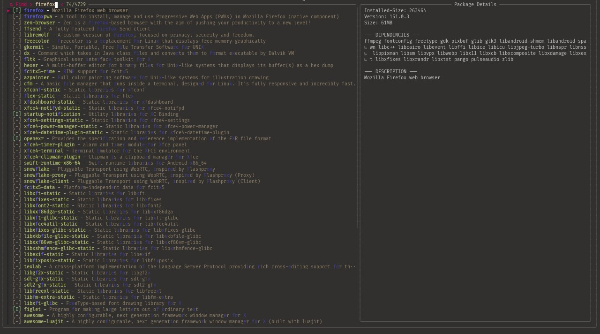

# Termux-TUI-Package-Store 📦

<p align="center">
  
</p>

<p align="center">
  <a href="https://github.com/Mark44928/Termux-TUI-Package-Store/releases">
    
  </a>
  <a href="https://github.com/Mark44928/Termux-TUI-Package-Store/stargazers">
    
  </a>
  <a href="https://github.com/Mark44928/Termux-TUI-Package-Store/blob/main/LICENSE">
    
  </a>
  <a href="https://github.com/Mark44928/Termux-TUI-Package-Store">
    
  </a>
  <a href="https://github.com/Mark44928/Termux-TUI-Package-Store/issues">
    
  </a>
</p>

**The TUI package manager wrapper for Termux.**

Termux-TUI-Package-Store is a high-performance, fzf-powered interface that replaces tedious manual pkg commands with a smooth, interactive TUI. It intelligently detects your terminal layout, visually highlights installed vs. available packages, and manages your software installation with a single keystroke.

[](https://www.star-history.com/#Mark44928/Termux-TUI-Package-Store&Date)
## 🛠 How It Works
The script operates as a bridge between your system's package database and an interactive fuzzy-finder.
 1. **Layout Detection**: Uses tput to measure your window size and automatically decides whether to split the screen horizontally or vertically.
 2. **Data Processing**: Runs a two-pass awk script. It first reads dpkg-query to identify installed items, then merges this with apt-cache search to provide a comprehensive list of every available package.
 3. **Live Previews**: As you highlight a package, the script dynamically pulls its metadata (Version, Section, Size) and dependency tree using apt-cache.
  4. **Action Binding**: Upon hitting Enter, it performs a status check on the package. If installed, it removes; if missing, it installs. After the operation, the store automatically re-opens so you can keep managing packages. Press Ctrl-C or Esc to exit.

## 🚀 One-Line Install

```sh
bash <(curl -fsSL https://raw.githubusercontent.com/Mark44928/Termux-TUI-Package-Store/main/install.sh)
```

## 🚀 Full Step-by-Step Installation
Follow these steps to integrate this TUI store into your Termux environment.
### 1. Install Dependencies
You need fzf for the interface, gawk for data processing, and cowsay for the status feedback.
```bash
pkg update && pkg upgrade && pkg install bat fzf cowsay coreutils gawk grep sed ncurses

```
### 2. Install the Script
Download and install the script to your PATH:
```bash
curl -fsSL https://raw.githubusercontent.com/Mark44928/Termux-TUI-Package-Store/main/pkgs_core.zsh -o $PREFIX/bin/pkgs && chmod +x $PREFIX/bin/pkgs

```
### 3. Usage
Simply type the following into your terminal:
```bash
pkgs

```
## 🔧 Advanced Tweaks & Configuration
You can go beyond the basics by fine-tuning the internal logic of pkgs.zsh. Edit the file at `$PREFIX/bin/pkgs` to make the tool truly yours:
 * **Customizing the Preview Window**:
   * Want the preview to be larger? Modify PORTRAIT_SPLIT="down:48%:wrap" to a higher percentage like down:60%:wrap.
   * Prefer the preview on the left instead of the right? In LANDSCAPE_SPLIT="right:40%:wrap", change right to left.
   * You can also add --cycle or --scrollbar to the FZF_ARGS array if you want more navigation control.
 * **Deep Color Palette Tweaking**:
   * The --color flag in the _pkgs_build_fzf_args function is the key to a custom aesthetic. You can map any of the ANSI 256 colors to specific elements like fg+ (current line foreground), bg+ (current line background), or hl+ (highlighted match in the current line).
   * Example: Change pointer:161 (a vibrant red/pink) to pointer:045 for a crisp cyan accent.
 * **Enhancing the "Action" Logic**:
    * Look at the while loop at the bottom of the pkgs function. The action logic runs after fzf returns a selection.
    * Want to perform a reinstall instead of a basic install? Swap ${PKG_MGR} install "$pkg_name" for ${PKG_MGR} reinstall "$pkg_name".
    * Need to log your actions? Add a line like echo "$(date): Installed $pkg_name" >> ~/.pkgs_log inside the loop.
    * The store automatically re-opens after each operation. To quit, press Ctrl-C or Esc.
 * **Tuning the Preview Command**:
   * Want to see *more* than just the top 5 dependencies? Find the deps=$(...) line in _pkgs_preview_command and change head -n 5 to head -n 10 or remove the | head -n 5 pipe entirely to see the full list.
   * Tired of the cowsay message? Replace the cowsay line in _pkgs_preview_command with a simple echo "No dependencies found." to speed up the preview rendering.
 * **Optimizing Performance**:
   * If you have a massive amount of packages and the awk processing feels slow, you can cache the package list to a temporary file. Simply point _pkgs_generate_list to read from a file that updates only once a day instead of running apt-cache search every single time you launch the script.
 * **Data Parsing Precision**:
   * The awk block uses match($0, / - /) to split the package name from the description. If your specific apt output format varies or contains unusual characters, you can adjust this regex. For example, changing it to match($0, / {2,}/) might be better if your package descriptions are separated by multiple spaces rather than a hyphen.
 * **Terminal Environment Overrides**:
   * If your terminal emulator struggles with specific ANSI colors, you can override the C_ variables to use standard 16-color codes instead of the complex escape sequences. This ensures maximum compatibility across different Termux themes or fonts.
 * **Log Everything**:
    * Add a helper variable local LOG_FILE="$HOME/.pkgs_history" and append to it within the while loop. This gives you a permanent record of every package you've ever installed or removed via the script—super useful for cleaning up your system later.
 * **Switch Package Manager**:
    * Change `PKG_MGR="pkg"` to `PKG_MGR="apt"` to use apt directly. Useful if you want the raw apt output or need to bypass pkg's extra checks.
 * **Batch Multi-Select Mode**:
    * Add `--multi` to the `FZF_ARGS` array to allow selecting multiple packages with Tab. Then change the while loop to iterate over `$selection` (which becomes a newline-separated list) and process each package in sequence.
 * **Confirmation Prompt**:
    * Wrap the install/remove commands with a `read -q "confirm?Proceed? (y/N) "` to ask for confirmation before each operation. Great for avoiding accidental installs.
 * **Custom Prompt Icon**:
    * Swap the `--prompt="  Find > "` string for any icon or text you prefer, like `--prompt=" 🔍 "` or `--prompt=" Search > "`.
 * **Pre-Fill Default Search**:
    * Pass a default query via `pkgs somekeyword` — the `$*` argument is already wired to the fzf `--query` flag. For a hard-coded default, change `--query "$query"` to `--query="python"` to always start with Python packages listed.
 * **Exclude Unwanted Packages**:
    * Append `| grep -vE '^(lib|python-|perl-|ruby-)'` to the `_pkgs_generate_list` pipeline to filter out library packages and focus on end-user software.
 * **Toggle Fullscreen / Floating**:
    * Add `--height=80%` to the `FZF_ARGS` array for a floating overlay instead of fullscreen. Combine with `--border` options like `--border=sharp` or `--border=double` for a different look.
 * **Hide Installed Packages**:
    * In `_pkgs_generate_list`, pipe through `grep -v '\[I\]'` after the awk script to only show packages that aren't yet installed — ideal for discovering new software.
> **Pro Tip 2 (The "Stealth" Mode)**: If you're tired of seeing the package description every time, you can hide the preview window by default by changing --preview-window="$PREVIEW_LAYOUT" to --preview-window="$PREVIEW_LAYOUT:hidden". You can then press ? to toggle it on only when you need it.
> 
> **Pro Tip 3 (Dynamic Scaling)**: Instead of hard-coding PORTRAIT_SPLIT, you can write a secondary if/else block that calculates the percentage based on total screen height, ensuring that the preview window is always exactly 5 lines less than your terminal height.
> 
> **Pro Tip 4 (Filter Optimization)**: You can expand the _pkgs_generate_list command by adding a grep -v filter to exclude specific library packages (like lib* or python-dev-*) from the list, keeping your search results cleaner and focusing only on end-user software.
> 
> **Pro Tip 5 (Fast Reinstall)**: Bind a separate key like `ctrl-r` to reinstall the selected package without leaving fzf by adding `--bind "ctrl-r:execute(${PKG_MGR} reinstall {1})+reload(...)"` to FZF_ARGS.
> 
> **Pro Tip 6 (Keep Query on Return)**: By default the search resets each time the store re-opens. To preserve your query, store it in a variable before fzf exits and pass it back: `query=$(_pkgs_generate_list | fzf --query "$query" --print-query ...)` and tweak the loop to use `$query` instead of `$*`.
> 

## When Reporting Bugs... 🐛

Please include:
- Android version
- Termux version
- Shell (zsh/bash/ksh)
- Error message
- Device model
- Screenshot (if applicable)
